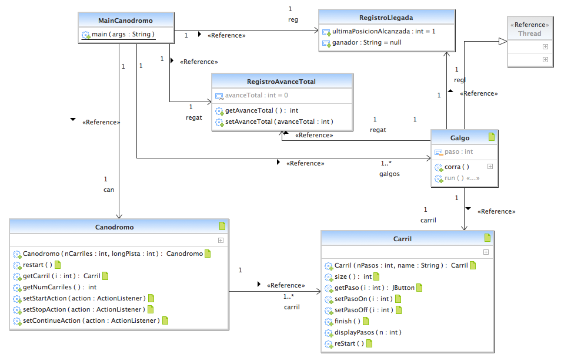

### Escuela Colombiana de Ingeniería

### Arquitecturas de Software – ARSW
## Laboratorio Programación concurrente, condiciones de carrera, esquemas de sincronización, colecciones sincronizadas y concurrentes - Caso Dogs Race

### Descripción:
Este ejercicio tiene como fin que el estudiante conozca y aplique conceptos propios de la programación concurrente.

### Parte I 
Antes de terminar la clase.

Creación, puesta en marcha y coordinación de hilos.

1. Revise el programa “primos concurrentes” (en la carpeta parte1), dispuesto en el paquete edu.eci.arsw.primefinder. Este es un programa que calcula los números primos entre dos intervalos, distribuyendo la búsqueda de los mismos entre hilos independientes. Por ahora, tiene un único hilo de ejecución que busca los primos entre 0 y 30.000.000. Ejecútelo, abra el administrador de procesos del sistema operativo, y verifique cuantos núcleos son usados por el mismo.

2. Modifique el programa para que, en lugar de resolver el problema con un solo hilo, lo haga con tres, donde cada uno de éstos hará la tarcera parte del problema original. Verifique nuevamente el funcionamiento, y nuevamente revise el uso de los núcleos del equipo.

3. Lo que se le ha pedido es: debe modificar la aplicación de manera que cuando hayan transcurrido 5 segundos desde que se inició la ejecución, se detengan todos los hilos y se muestre el número de primos encontrados hasta el momento. Luego, se debe esperar a que el usuario presione ENTER para reanudar la ejecución de los mismo.


### Parte II 


Para este ejercicio se va a trabajar con un simulador de carreras de galgos (carpeta parte2), cuya representación gráfica corresponde a la siguiente figura:


En la simulación, todos los galgos tienen la misma velocidad (a nivel de programación), por lo que el galgo ganador será aquel que (por cuestiones del azar) haya sido más beneficiado por el *scheduling* del
procesador (es decir, al que más ciclos de CPU se le haya otorgado durante la carrera). El modelo de la aplicación es el siguiente:



Como se observa, los galgos son objetos ‘hilo’ (Thread), y el avance de los mismos es visualizado en la clase Canodromo, que es básicamente un formulario Swing. Todos los galgos (por defecto son 17 galgos corriendo en una pista de 100 metros) comparten el acceso a un objeto de tipo
RegistroLLegada. Cuando un galgo llega a la meta, accede al contador ubicado en dicho objeto (cuyo valor inicial es 1), y toma dicho valor como su posición de llegada, y luego lo incrementa en 1. El galgo que
logre tomar el ‘1’ será el ganador.

Al iniciar la aplicación, hay un primer error evidente: los resultados (total recorrido y número del galgo ganador) son mostrados antes de que finalice la carrera como tal. Sin embargo, es posible que una vez corregido esto, haya más inconsistencias causadas por la presencia de condiciones de carrera.

Parte III

1.  Corrija la aplicación para que el aviso de resultados se muestre
    sólo cuando la ejecución de todos los hilos ‘galgo’ haya finalizado.
    Para esto tenga en cuenta:

    a.  La acción de iniciar la carrera y mostrar los resultados se realiza a partir de la línea 38 de MainCanodromo.

    b.  Puede utilizarse el método join() de la clase Thread para sincronizar el hilo que inicia la carrera, con la finalización de los hilos de los galgos.

2.  Una vez corregido el problema inicial, corra la aplicación varias
    veces, e identifique las inconsistencias en los resultados de las
    mismas viendo el ‘ranking’ mostrado en consola (algunas veces
    podrían salir resultados válidos, pero en otros se pueden presentar
    dichas inconsistencias). A partir de esto, identifique las regiones
    críticas () del programa.

3.  Utilice un mecanismo de sincronización para garantizar que a dichas
    regiones críticas sólo acceda un hilo a la vez. Verifique los
    resultados.

4.  Implemente las funcionalidades de pausa y continuar. Con estas,
    cuando se haga clic en ‘Stop’, todos los hilos de los galgos
    deberían dormirse, y cuando se haga clic en ‘Continue’ los mismos
    deberían despertarse y continuar con la carrera. Diseñe una solución que permita hacer esto utilizando los mecanismos de sincronización con las primitivas de los Locks provistos por el lenguaje (wait y notifyAll).

Finalmente se modifico la clase Galgo quedando de la siguiente manera, donde se realiza la modificacion del metodo corre quedado de la siguiente forma:

```
public void corra() throws InterruptedException {
		while (paso < carril.size()) {
			if (activo==true) {
				synchronized (this){
					wait();
					activo=false;
				}
			}
			Thread.sleep(100);
			carril.setPasoOn(paso++);
			carril.displayPasos(paso);
			if (paso == carril.size()) {
				carril.finish();
				synchronized (regl) {
					int ubicacion = regl.getUltimaPosicionAlcanzada();
					regl.setUltimaPosicionAlcanzada(ubicacion + 1);
					System.out.println("El galgo " + this.getName() + " llego en la posicion " + ubicacion);
					if (ubicacion == 1) {
						regl.setGanador(this.getName());
					}
				}

			}
		}
	}
```

Ademas de esto se realizo la implementacion de los metodos **Continuar** y **Stoped**, en los cuales se realizo la funcion requerida de valga la redundancia de pausar la carrera de Galgos con stoped y de continuar las veces que sea necesario con Continuar, estas quedaron de la siguiente manera:

```
	public void stoped() {
		activo=true;
	}

	public void continuar() {
		synchronized (this){
			notifyAll();
		}
	}
}
```

Bajo la implementacion y correcion basada en el punto III solicitada, se modifico igualmente la clase **MainCanodromo** la cual quedo de la siguiente manera:

```
package arsw.threads;

import java.awt.event.ActionEvent;
import java.awt.event.ActionListener;

import javax.swing.JButton;

public class MainCanodromo {

    private static Galgo[] galgos;

    private static Canodromo can;

    private static RegistroLlegada reg = new RegistroLlegada();

    public static void main(String[] args) {
        can = new Canodromo(17, 100);
        galgos = new Galgo[can.getNumCarriles()];
        can.setVisible(true);

        //Acción del botón start
        can.setStartAction(
                new ActionListener() {

                    @Override
                    public void actionPerformed(final ActionEvent e) {
						//como acción, se crea un nuevo hilo que cree los hilos
                        //'galgos', los pone a correr, y luego muestra los resultados.
                        //La acción del botón se realiza en un hilo aparte para evitar
                        //bloquear la interfaz gráfica.
                        ((JButton) e.getSource()).setEnabled(false);
                        for (int i = 0; i < can.getNumCarriles(); i++) {
                            //crea los hilos 'galgos'
                            galgos[i] = new Galgo(can.getCarril(i), "" + i, reg);
                        }
                        new Thread() {
                            public void run() {
                                synchronized (this) {
                                    for (int i = 0; i < can.getNumCarriles(); i++) {
                                        //Inicia los hilos
                                        galgos[i].start();
                                    }
                                }
                            }
                        }.start();

                        new Thread() {
                            public void run() {
                                synchronized (this) {
                                    for (int i = 0; i < can.getNumCarriles(); i++) {
                                        try {
                                            galgos[i].join();
                                        } catch (InterruptedException interruptedException) {
                                            interruptedException.printStackTrace();
                                        }
                                    }
                                    can.winnerDialog(reg.getGanador(),reg.getUltimaPosicionAlcanzada() - 1);
                                    System.out.println("El ganador fue:" + reg.getGanador());
                                }


                            }

                        }.start();


                    }
                }
        );

        can.setStopAction(
                new ActionListener() {
                    @Override
                    public void actionPerformed(ActionEvent e) {
                        for (int i = 0; i < can.getNumCarriles(); i++) {
                            galgos[i].stoped();
                        }
                        System.out.println("Carrera pausada!");
                    }
                }
        );

        can.setContinueAction(
                new ActionListener() {
                    @Override
                    public void actionPerformed(ActionEvent e) {
                        for (int i = 0; i < can.getNumCarriles(); i++) {
                            galgos[i].continuar();
                        }
                        System.out.println("Carrera reanudada!");
                    }
                }
        );

    }

}

```


###Funcionamiento

Es posible evidenciar en las siguientes imagenes como inicia la aplicación:


posteriormente al pausar la carrera de Galgos:


y por ultimo de la partida en el momento que continuo la carrera de Galgos:


La salida de la anterior prueba de funcionamiento como prueba de aceptacion arrojo la siguiente salida, donde es posible evidenciar que no tiene ninguna inconsistencia en cuanto a los puestos en los cuales clasificaba cada Galgo:

```
		Carrera pausada!
		Carrera reanudada!
		El galgo 13 llego en la posicion 1
		El galgo 15 llego en la posicion 2
		El galgo 16 llego en la posicion 3
		El galgo 10 llego en la posicion 4
		El galgo 2 llego en la posicion 5
		El galgo 12 llego en la posicion 6
		El galgo 1 llego en la posicion 7
		El galgo 4 llego en la posicion 8
		El galgo 5 llego en la posicion 9
		El galgo 14 llego en la posicion 10
		El galgo 11 llego en la posicion 11
		El galgo 8 llego en la posicion 12
		El galgo 7 llego en la posicion 13
		El galgo 9 llego en la posicion 14
		El galgo 0 llego en la posicion 15
		El galgo 6 llego en la posicion 16
		El galgo 3 llego en la posicion 17
		El ganador fue:13

```


## Control de versiones

por: 
+ [Santiago Buitrago](https://github.com/DonSantiagoS) 
+ [Steven Garzon](https://github.com/stevengarzon7) 

Version: 1.0
Fecha: 02 de febrero 2021

###Autores

* **Santiago Buitrago** - *Laboratorio N°2* - [DonSantiagoS](https://github.com/DonSantiagoS)
* **Steven Garzon** - *Laboratorio N°2* - [stevengarzon7](https://github.com/stevengarzon7)

## Licencia 

This project is licensed under the MIT License - see the [LICENSE.md](LICENSE.md) file for details

## Agradecimientos

* Persistencia en lograr el objetivo

